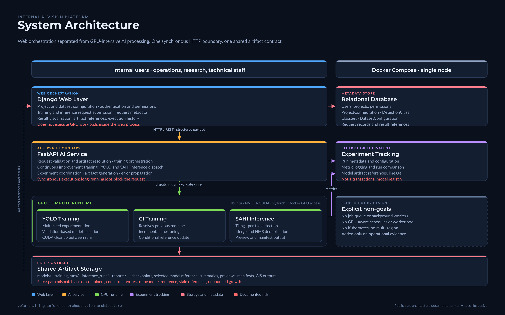
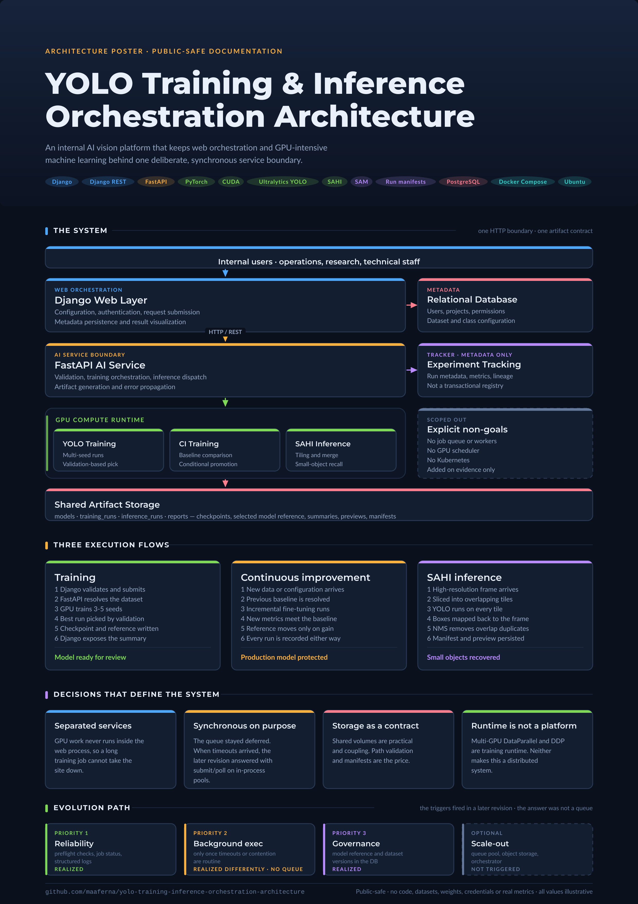

# YOLO Training & Inference Orchestration Architecture

## Technology & Architecture Stack

This repository documents an internal production-oriented AI vision platform architecture that combines web orchestration, GPU-backed machine learning services, dataset configuration management, experiment tracking, and research-oriented computer vision workflows.

### Core Platform


### Machine Learning & Computer Vision


### MLOps, Experiment Tracking & Data Engineering


### Infrastructure & Runtime


### Architecture Scope


## ⚠️ Public-Safe Documentation Repository

**This repository contains generalized, anonymized architecture documentation only. It is not a production release of private source code.**

This repository documents a public-safe architecture pattern for an internal AI vision platform that separates user-facing web workflows from GPU-intensive machine learning workloads.

It is intended for portfolio, technical communication, and architecture review purposes. It does not include runnable application code, private datasets, model weights, credentials, real metrics, real infrastructure details, or production deployment files.

---

## What This Repository Is

This repository documents **architectural decisions for a web-connected AI vision platform** designed for controlled internal agricultural, industrial, or research-oriented workflows.

It demonstrates:

- **Microservice separation:** a Django-based web and administration layer separated from a FastAPI-based AI processing layer.
- **GPU-backed AI execution:** YOLO training, validation, inference, SAHI-based high-resolution inference, and experiment workflows executed through a dedicated compute service.
- **Training runtime flexibility:** single-GPU and multi-GPU training runtime strategies, including DataParallel support and evaluated DDP patterns where applicable.
- **Dataset configuration management:** database-backed dataset configuration, label/class metadata, and public-safe documentation of YOLO-compatible dataset configuration generation.
- **MLOps foundations:** experiment tracking, metric logging, artifact lineage, and model reference management using lightweight tracking patterns.
- **Research workflow support:** notebook-oriented experimentation and synthetic dataset generation workflows documented as auxiliary research and dataset engineering paths.
- **Operational risk analysis:** explicit discussion of synchronous execution, shared storage coupling, GPU contention, artifact governance, and scale-out triggers.
- **Fit-for-purpose evolution planning:** a roadmap focused on internal reliability, traceability, and controlled operational growth rather than premature distributed infrastructure.

**Positioning:** Internal production-oriented AI vision platform architecture for controlled agricultural and research workflows.

### Operating System Runtime Decision

Ubuntu was selected as the preferred operating system environment for GPU-backed training and inference workflows.

This decision was important because deep learning workloads involving PyTorch, CUDA, NVIDIA drivers, Ultralytics YOLO, and multi-GPU training are highly sensitive to operating system compatibility, driver versions, CUDA runtime configuration, and multiprocessing behavior.

During development, alternative environments were considered or tested. Windows was suitable for simpler single-GPU execution, but multi-GPU and DDP-oriented workflows introduced additional operational complexity. Other Linux distributions can work, but may require more manual dependency resolution depending on driver, CUDA, PyTorch, and package compatibility.

For this architecture, Ubuntu provides a more predictable and commonly supported runtime baseline for:

- NVIDIA driver installation;
- CUDA toolkit compatibility;
- PyTorch GPU execution;
- Docker-based GPU workloads;
- multi-GPU training experiments;
- Linux-native filesystem and process behavior;
- reproducible deployment on GPU workstations or servers.

This does not mean Ubuntu is the only valid option. It means Ubuntu was selected as the preferred baseline to reduce runtime friction and improve reproducibility for GPU-intensive computer vision workflows.

---

## What This Repository Is Not

🚫 **This repository does not contain:**

- production source code from the private implementation;
- actual datasets or training data;
- real trained model weights;
- real metrics or performance results;
- real coordinates, detections, or inference outputs;
- client, institution, farm, field, or researcher names;
- credentials, secrets, API keys, or workspace identifiers;
- absolute local paths or environment-specific configurations;
- ClearML, CVAT, Roboflow, cloud, or server workspace names;
- real screenshots, generated images, masks, previews, or model outputs;
- runnable Django, FastAPI, YOLO, SAHI, SAM, ClearML, Docker, or notebook code;
- production Dockerfiles or deployable containers;
- private IP, deployment infrastructure, or operational playbooks.

This repository does not contain the private implementation, datasets, trained weights, real metrics, credentials, or production deployment files.

---

## Maturity Tier: Internal Production-Oriented Architecture

This repository documents an architecture designed for a **controlled internal deployment context**, not a public SaaS product, a large-scale multi-tenant platform, or a globally distributed service.

The expected users are a limited group of operational, technical, research, or analysis staff who submit scheduled or occasional training, inference, validation, and research-oriented jobs. In this context, a single-node or small-server deployment using Docker Compose, a dedicated AI service, GPU-backed execution, and shared artifact storage can be sufficient when workloads are predictable and concurrency is low.

| Aspect | Status | Notes |
|--------|--------|-------|
| Deployment context | Internal platform | Designed for controlled organizational use, not public multi-tenant SaaS. |
| Request handling | Synchronous / controlled | Acceptable when job frequency is low and users understand long-running operations. |
| Job queuing | Optional future improvement | Needed only if concurrent jobs, request timeouts, or operational contention become frequent. |
| Training GPU execution | Implemented / evaluated | GPU-backed training can use single-GPU or multi-GPU runtime strategies depending on environment and configuration. |
| Distributed job orchestration | Not required for current scope | Worker pools and distributed schedulers are unnecessary unless workload volume increases. |
| Kubernetes orchestration | Not required | Docker Compose or a managed single-server deployment is more appropriate for the current operational scale. |
| Model registry | Lightweight tracking | Experiment tracking and local artifact references are sufficient unless formal governance requirements increase. |
| Inference serving | Per-request / batch-oriented | Suitable for scheduled internal analysis, research workflows, and controlled operational review. |
| Observability | Basic required | Structured logs, job status, storage checks, and GPU health checks are more relevant than distributed tracing at this scale. |
| High availability | Optional | Redundancy is a business decision; it may not be justified for occasional internal workloads. |

**Philosophy:** Build for the real operational context. For a controlled internal platform, reliability, traceability, usability, and artifact governance are more important than premature distributed infrastructure.

---

## Core Architecture Summary

The system separates web orchestration from GPU-intensive AI processing:

```text
User / Operator
      ↓
Django Web Layer
      ↓ HTTP
FastAPI AI Service Layer
      ↓
YOLO / SAHI / Training Runtime
      ↓
GPU Runtime + Shared Artifact Storage
      ↓
Django Result Visualization
```

For a comprehensive visual and textual overview, see [`docs/architecture/02-system-architecture.md`](./docs/architecture/02-system-architecture.md).

---

## Architecture Diagrams

Rendered diagrams for reading, presenting and portfolio use. All are generated from
[`scripts/build_visuals.py`](./scripts/build_visuals.py); the PNGs and the SVGs in `assets/src/`
are build products, not hand-edited files.

[](./assets/diagrams/01-system-architecture.png)

| Diagram | What it answers |
|---|---|
| [01 · System architecture](./assets/diagrams/01-system-architecture.png) | How the layers separate and what talks to what |
| [02 · Training request flow](./assets/diagrams/02-training-flow.png) | What happens between a submitted request and a selected model |
| [03 · Continuous improvement](./assets/diagrams/03-ci-training-flow.png) | How the system decides whether a new model replaces the old one |
| [04 · SAHI tiled inference](./assets/diagrams/04-sahi-inference.png) | Why tiling recovers small objects, and what it costs |
| [05 · Deployment and cost strategy](./assets/diagrams/05-deployment-strategy.png) | Local, cloud or hybrid — and the reasoning behind the choice |
| [06 · Synthetic dataset generation](./assets/diagrams/06-synthetic-dataset.png) | How scarce annotated data is expanded into a usable dataset |
| [07 · Production evolution roadmap](./assets/diagrams/07-evolution-roadmap.png) | What gets added first, and which trigger justifies it |

### One-page poster

A single A2 sheet covering the system, the three execution flows, the defining decisions and the
evolution path — sized for print at A2/150 dpi or A3/212 dpi, and for use as a portfolio or
presentation asset.

[](./assets/poster/poster-architecture.png)

To regenerate everything after a documentation change:

```bash
./scripts/render-visuals.sh          # all diagrams and the poster
./scripts/render-visuals.sh poster   # only what matches "poster"
```

Requires `python3` and `rsvg-convert` (`librsvg2-tools` on Fedora, `librsvg2-bin` on Debian/Ubuntu).

---

## Clear Responsibility Boundaries

Explicit responsibility separation prevents architectural complexity and makes failure modes easier to reason about.

- **Django:** web UI, authentication, request metadata, dataset configuration, result visualization. It should not directly execute GPU-heavy model training.
- **FastAPI:** AI service boundary for training orchestration, inference dispatch, validation, and experiment coordination. It should not own user authentication or web presentation logic.
- **YOLO Training Runtime:** model training, validation, metric extraction, and checkpoint production.
- **SAHI Inference Layer:** high-resolution image tiling, small-object inference, and detection reconstruction.
- **Experiment Tracking:** run metadata, metric logging, artifact references, and model lineage.
- **PostgreSQL / Relational Database:** user data, configuration metadata, request records, and system metadata.
- **Shared Artifact Storage:** checkpoints, generated outputs, previews, reports, and inference artifacts.

For the full responsibility matrix, see [`docs/architecture/03-component-responsibilities.md`](./docs/architecture/03-component-responsibilities.md).

---

## Main Components

### 1. Django Web Application

Request submission, dataset configuration, project metadata, result visualization, and administrative workflows.

### 2. FastAPI AI Service

AI orchestration boundary coordinating training, inference, validation, artifact generation, and experiment tracking.

### 3. YOLO Training Engine

Training workflows using YOLO-based object detection models, multi-seed experimentation, validation-based model selection, and checkpoint management.

### 4. Continuous Improvement Training

Incremental retraining workflow that compares new results against a previous baseline and updates the model reference only when improvement criteria are met.

### 5. SAHI Inference Engine

High-resolution tiled inference for small-object detection, detection reconstruction, and output artifact generation.

### 6. Experiment Tracking Layer

Tracking of experiment metadata, metrics, artifacts, lineage, and failure context using public-safe MLOps documentation patterns.

### 7. Dataset Configuration Layer

Database-backed configuration management for project definitions, detection classes, class sets, dataset configuration files, and training payload preparation.

> Public-safe names are used throughout the repository: `ProjectConfiguration`, `DetectionClass`, `ClassSet`, and `DatasetConfiguration`.

### 8. Synthetic Dataset Generation Workflow

Auxiliary dataset engineering workflow based on SAM-assisted object extraction, RGBA cutout generation, synthetic scene composition, and annotation export.

### 9. GPU Resource Management

CUDA memory management, single-GPU or multi-GPU training runtime strategies, DataParallel support, evaluated DDP patterns, and future resource scheduling considerations.

---

## Technology Stack & Integration Patterns

| Layer | Technology | Integration Pattern |
|-------|------------|---------------------|
| Web | Django + Django REST Framework | Request validation, user workflows, ORM-backed metadata persistence |
| AI Service | FastAPI | Internal service boundary for GPU-backed training and inference orchestration |
| Training | PyTorch + Ultralytics YOLO | Multi-seed experimentation, validation-based selection, checkpoint generation |
| Inference | YOLO + SAHI | High-resolution tiling strategy for small-object detection |
| Experiment Tracking | ClearML or equivalent tracker | Metadata logging, metric comparison, artifact lineage |
| Database | PostgreSQL or equivalent relational DB | User data, project metadata, configuration records, request history |
| GPU Execution | CUDA + PyTorch | GPU-backed training and inference with single-GPU or multi-GPU runtime strategies depending on environment and configuration |
| Containerization | Docker Compose | Controlled internal deployment; Kubernetes is optional and only justified by operational scale or availability requirements |
| Storage | Shared volumes | Practical artifact exchange for internal workflows; future storage abstraction is optional if governance becomes difficult |
| Research Workflow | Jupyter Notebook | Auxiliary experimentation and validation workflow, not the primary production execution path |
| Synthetic Data | SAM + OpenCV + Pillow + NumPy | Dataset engineering workflow for object extraction, synthetic composition, and annotation export |

**Integration Philosophy:** keep concerns separated. Use HTTP between services, a relational database for metadata, and artifact storage for generated files. Add queues, workers, object storage, or orchestration only when operational evidence justifies the complexity.

---

## What This Repository Demonstrates

### A. System Design Thinking

- **Responsibility separation:** Django handles web orchestration; FastAPI isolates GPU-heavy AI processing.
- **Failure mode analysis:** the architecture documents known failure categories and mitigation strategies.
- **Synchronous-first pragmatism:** controlled internal workloads can start with direct HTTP-based orchestration when concurrency is low and long-running jobs are expected.
- **Scale-by-evidence philosophy:** queues, workers, and Kubernetes are optional responses to real bottlenecks, not default requirements.

### B. AI/ML Architecture Knowledge

- **Multi-seed experimentation:** training can be evaluated across multiple runs for more robust model selection.
- **Model selection logic:** validation metrics drive model reference updates rather than manual checkpoint selection.
- **High-resolution inference:** SAHI tiling trades compute for better small-object detection in large images.
- **GPU resource management:** CUDA context handling, memory cleanup, and single-GPU or multi-GPU training runtime strategies.
- **Experiment tracking:** metric logging and lineage support reproducibility and debugging.

### C. Backend Integration & Full-Stack Patterns

- **Web-to-compute communication:** synchronous HTTP is sufficient for controlled internal workflows, with an optional path toward queues if operational pain appears.
- **Shared storage orchestration:** Docker volumes or equivalent shared storage simplify artifact exchange in internal deployments.
- **Database and artifact separation:** relational metadata remains separate from ML outputs and generated files.
- **Configuration management:** dataset and training configuration are represented as structured metadata before execution.
- **Error propagation:** infrastructure, GPU, storage, and validation failures are mapped to operationally meaningful categories.

### D. Production Evolution Thinking

- **Fit-for-purpose deployment:** avoids Kubernetes, distributed queues, and object storage until the operational context actually requires them.
- **Reliability-first roadmap:** prioritizes preflight validation, job status, logs, storage checks, GPU checks, and artifact manifests before scale-out.
- **Cost awareness:** complexity is added only when real constraints appear.

### E. Responsible Public Documentation

- **Anonymized architecture:** no customer, institution, field, or private project identifiers.
- **Public-safe examples:** placeholders are used for paths, payloads, classes, metrics, and outputs.
- **Educational value preserved:** architecture patterns are reusable while private implementation details remain excluded.
- **Security discipline:** publication guidance and sanitization checklists are part of the repository.

### Not Demonstrated

- ❌ Public SaaS product architecture.
- ❌ High-throughput multi-tenant model serving.
- ❌ Current Kubernetes orchestration requirement.
- ❌ Multi-region or high-availability architecture for external customers.
- ❌ Source-code-level implementation of the private system.
- ❌ Fully automated enterprise MLOps platform.

---

## The Questions This Architecture Answers

The reasoning is spread across the documents below. If you want the argument rather than the
specification, these are the questions worth reading for, each with where it is answered:

| Question | Where |
|---|---|
| Why are Django and FastAPI separated at all? | [`ADR-001`](./docs/architecture/adr/ADR-001-separate-web-and-ai-services.md) |
| Why should GPU work never run inside the web layer? | [`03-component-responsibilities.md`](./docs/architecture/03-component-responsibilities.md) |
| When is synchronous execution acceptable, and when does it stop being so? | [`15-limitations-and-risks.md`](./docs/architecture/15-limitations-and-risks.md) |
| What exactly justifies adding a job queue? | [`16-production-evolution-roadmap.md`](./docs/architecture/16-production-evolution-roadmap.md) |
| Why is shared storage both practical and a liability? | [`07-shared-storage-and-artifacts.md`](./docs/architecture/07-shared-storage-and-artifacts.md) |
| Why are notebooks useful for research but not as a production execution model? | [`ADR-006`](./docs/architecture/adr/ADR-006-notebooks-auxiliary-research.md) |
| Why is Kubernetes optional rather than inevitable? | [`16-production-evolution-roadmap.md`](./docs/architecture/16-production-evolution-roadmap.md) |
| Where should training run, and where should the application live? | [`20-deployment-cost-strategy.md`](./docs/architecture/20-deployment-cost-strategy.md) |

---

## System Flow Summary

### Training Flow

1. A user submits a training request through the Django web layer.
2. Django validates metadata and prepares a public-safe training request structure.
3. FastAPI receives the request and delegates to the training runtime.
4. Training executes on the available GPU runtime.
5. Validation metrics and checkpoints are persisted as artifacts.
6. The selected model reference and run metadata are recorded.
7. Django exposes the result summary for review.

### Continuous Improvement Training Flow

1. New data or configuration is submitted for incremental training.
2. The previous model reference is resolved.
3. Training executes using the configured baseline.
4. New metrics are compared against the historical reference.
5. The model reference is updated only if the improvement rule is satisfied.
6. Tracking metadata and artifacts are recorded.

### Inference Flow

1. A user submits images or a batch inference request.
2. FastAPI receives and validates the request.
3. High-resolution images are processed using direct YOLO inference or SAHI tiling.
4. Tile-level detections are reconstructed into image-level outputs.
5. Output metadata, previews, and artifacts are persisted.
6. Django renders or links the generated results.

### Artifact Exposure Flow

1. The AI service writes artifacts to shared storage.
2. The web layer resolves artifacts through its configured media or artifact access path.
3. The UI displays previews, summaries, and downloadable outputs.
4. Error states are surfaced with operational context.

---

## Architectural Evolution Path

This repository demonstrates **fit-for-purpose growth thinking**. The architecture is designed for a controlled internal deployment context, not for a public SaaS or large-scale multi-tenant platform.

The goal is not to add distributed infrastructure by default. The goal is to preserve reliability, traceability, GPU workload isolation, and operational simplicity for a limited group of users running scheduled training, inference, validation, or research-oriented workflows.

### Current State: Internal Production-Oriented Architecture

- Django web layer for configuration, request submission, metadata, and result visualization.
- FastAPI AI service for GPU-backed training, validation, and inference orchestration.
- Synchronous HTTP request/response between Django and the AI service.
- Shared artifact storage for model checkpoints, inference outputs, previews, and generated files.
- GPU-backed execution with single-GPU or multi-GPU training runtime depending on environment and configuration.
- Experiment tracking and metric logging.
- Basic error handling and operational diagnostics.

This design can be sufficient for a controlled internal platform when workload volume is predictable, users are limited, and long-running jobs are expected.

### Priority 1: Operational Reliability

Add these improvements before considering distributed infrastructure:

- preflight validation for datasets, model checkpoints, output directories, storage mounts, and GPU availability;
- explicit job status records;
- structured logs with correlation IDs;
- clearer user-facing error states;
- storage health checks;
- GPU memory and availability checks;
- artifact manifests for generated outputs;
- backup policy for important datasets, models, and results.

### Priority 2: Controlled Background Execution

Add a lightweight queue only if synchronous execution becomes operationally painful.

Possible triggers:

- users experience repeated HTTP timeouts;
- more than one long-running job is frequently submitted at the same time;
- training and inference jobs compete for the same GPU resources;
- operators need cancellation, retry, progress tracking, or resumability.

Potential additions:

- lightweight queue;
- single GPU worker;
- job status polling;
- controlled retry policy;
- GPU resource locking.

### Priority 3: Artifact and Model Governance

Improve traceability before scaling infrastructure:

- database-backed model reference tracking;
- dataset version registry;
- artifact manifest per execution;
- immutable run identifiers;
- retention policy for large outputs;
- clear separation between raw data, generated outputs, and publishable artifacts.

### Optional Scale-Out Path

Distributed workers, Kubernetes, and object storage are optional future improvements, not mandatory next steps.

They are justified only if the operational context changes, for example:

- multiple concurrent users submit long-running jobs regularly;
- artifact storage exceeds local operational capacity;
- uptime requirements become business-critical;
- deployment must span multiple servers or locations;
- manual operation becomes too costly or unreliable.

Potential additions:

- GPU worker pool;
- object storage such as S3, GCS, MinIO, or equivalent;
- Kubernetes or another orchestrator;
- centralized monitoring and alerting;
- distributed tracing.

**Philosophy:** Scale by operational evidence, not by default. For a controlled internal AI platform, simplicity, reliability, and traceability are more valuable than premature distributed infrastructure.

For detailed roadmap reasoning, see [`docs/architecture/16-production-evolution-roadmap.md`](./docs/architecture/16-production-evolution-roadmap.md).

---

## Repository Structure

```text
yolo-training-inference-orchestration-architecture/
├── README.md
├── LICENSE
├── .gitignore
├── docs/
│   ├── architecture/
│   │   ├── 01-context-and-problem.md
│   │   ├── 02-system-architecture.md
│   │   ├── 03-component-responsibilities.md
│   │   ├── 04-system-flow.md
│   │   ├── 05-api-integration-contracts.md
│   │   ├── 06-docker-runtime-architecture.md
│   │   ├── 07-shared-storage-and-artifacts.md
│   │   ├── 08-yolo-dataset-configuration-management.md
│   │   ├── 09-yolo-training-engine.md
│   │   ├── 10-continuous-improvement-training.md
│   │   ├── 11-sahi-inference-engine.md
│   │   ├── 12-clearml-experiment-tracking.md
│   │   ├── 13-gpu-resource-management.md
│   │   ├── 14-error-handling-and-fallbacks.md
│   │   ├── 15-limitations-and-risks.md
│   │   ├── 16-production-evolution-roadmap.md
│   │   ├── 17-public-release-sanitization.md
│   │   ├── 18-technical-responsibilities.md
│   │   ├── 19-inference-result-synchronization.md
│   │   ├── 20-deployment-cost-strategy.md
│   │   └── 21-synthetic-dataset-generation-pipeline.md
│   │   └── adr/
│   ├── portfolio/
│   └── operations/
├── diagrams/          # Mermaid sources
├── examples/
├── assets/            # generated diagrams and poster
├── scripts/           # sanitization gate and visual build
└── .github/
    └── public-safety-checklist.md
```

> Architecture documents are numbered `01` to `21`. The numbering is the reading order; gaps and duplicates are treated as defects.

---

## Documentation Index

### Core Architecture

| Document | Purpose |
|----------|---------|
| `01-context-and-problem.md` | Problem statement, context, and design motivation |
| `02-system-architecture.md` | High-level system architecture and layer boundaries |
| `03-component-responsibilities.md` | Responsibilities of each component |
| `04-system-flow.md` | Training, inference, configuration, and artifact flows |
| `05-api-integration-contracts.md` | Conceptual API payloads and integration contracts |
| `06-docker-runtime-architecture.md` | Container and runtime architecture |
| `07-shared-storage-and-artifacts.md` | Artifact storage, path mapping, and risks |
| `08-yolo-dataset-configuration-management.md` | Dataset configuration and YAML generation layer |
| `09-yolo-training-engine.md` | YOLO training runtime and validation strategy |
| `10-continuous-improvement-training.md` | Incremental training and model reference update logic |
| `11-sahi-inference-engine.md` | High-resolution SAHI inference pattern |
| `12-clearml-experiment-tracking.md` | Experiment tracking and lineage |
| `13-gpu-resource-management.md` | GPU runtime, memory, and multi-GPU considerations |
| `14-error-handling-and-fallbacks.md` | Error categories and mitigation patterns |
| `15-limitations-and-risks.md` | Current risks and limitations |
| `16-production-evolution-roadmap.md` | Internal platform evolution roadmap |
| `17-public-release-sanitization.md` | Public-safe documentation rules |
| `18-technical-responsibilities.md` | Portfolio-safe responsibilities |
| `19-inference-result-synchronization.md` | Synchronizing inference results back to the web layer |
| `20-deployment-cost-strategy.md` | Local, cloud, and hybrid deployment cost reasoning |
| `21-synthetic-dataset-generation-pipeline.md` | Synthetic dataset generation workflow |

---

## Current Maturity Level

**Internal Production-Oriented / Advanced Internal Platform**

- ✅ Core orchestration pattern documented.
- ✅ Django/FastAPI separation documented.
- ✅ GPU training and inference workflows represented.
- ✅ Experiment tracking and artifact lineage represented.
- ✅ Dataset configuration and research workflows documented.
- ✅ Public-safe sanitization policy included.
- ⚠️ Long-running tasks are synchronous unless future background execution is added.
- ⚠️ Shared artifact storage requires operational discipline.
- ⚠️ File-based model references can require stronger governance if concurrency increases.
- ⚠️ Observability is basic and should focus on logs, job status, GPU/storage checks, and artifact manifests.
- ❌ Not designed as a public SaaS or high-throughput multi-tenant platform.

---

## Key Limitations

### Current State

- No formal job queue in the documented current architecture.
- Long-running tasks may execute synchronously through the AI service.
- Shared filesystem coupling can create operational fragility.
- Lightweight model references may not be sufficient under high concurrency.
- Observability is limited compared with enterprise distributed systems.
- Retry, cancellation, and progress tracking may require future background execution.
- Kubernetes, object storage, and worker pools are optional, not current requirements.

### Why These Exist

These are intentional trade-offs for a controlled internal platform. The architecture prioritizes simplicity, reliability, traceability, and usability for a limited user base over premature distributed infrastructure.

---

## Production Evolution Roadmap

Recommended next steps focus on internal operational reliability:

### Priority 1: Reliability

- [ ] Add preflight validation for datasets, storage, models, outputs, and GPU availability.
- [ ] Add explicit job status records.
- [ ] Add structured logs with correlation IDs.
- [ ] Add artifact manifests for generated outputs.
- [ ] Add storage and GPU health checks.
- [ ] Define backup and retention policies.

### Priority 2: Controlled Background Execution

- [ ] Add a lightweight queue only if synchronous execution causes timeouts or operational contention.
- [ ] Add a single GPU worker or controlled worker process.
- [ ] Add job cancellation and retry policy.
- [ ] Add progress/status polling.
- [ ] Add GPU resource locking.

### Priority 3: Governance

- [ ] Add a database-backed model reference registry if file-based references become risky.
- [ ] Add dataset version tracking.
- [ ] Link training runs to dataset configuration versions.
- [ ] Validate generated artifacts before visualization or downstream use.

### Optional Scale-Out

- [ ] Add distributed workers only if concurrent long-running workloads exceed current capacity.
- [ ] Add object storage only if local storage becomes hard to govern.
- [ ] Add Kubernetes only if multi-server deployment, uptime requirements, or operational complexity justify it.

For details, see [`docs/architecture/16-production-evolution-roadmap.md`](./docs/architecture/16-production-evolution-roadmap.md).

---

## Confidentiality Policy

**This repository is designed to be publicly shareable while protecting private IP and sensitive data.**

### Never Commit

- ❌ source code from the private project;
- ❌ real datasets, images, labels, masks, shapefiles, GeoJSON, or generated outputs;
- ❌ trained model weights or checkpoints;
- ❌ real metrics or experimental results;
- ❌ real coordinates or field identifiers;
- ❌ client, institution, farm, field, or researcher names;
- ❌ credentials, API keys, tokens, or secrets;
- ❌ absolute local paths or environment-specific configuration;
- ❌ workspace identifiers from external tools;
- ❌ screenshots or visual outputs from private data.

### Always Use

- ✅ placeholder values;
- ✅ anonymized examples;
- ✅ generic architecture diagrams;
- ✅ illustrative payloads;
- ✅ public-safe conceptual descriptions;
- ✅ documentation-only examples.

---

## Suggested Reading Path

### Recruiters / Portfolio Reviewers

1. README.md
2. `docs/architecture/01-context-and-problem.md`
3. `docs/architecture/03-component-responsibilities.md`
4. `docs/architecture/18-technical-responsibilities.md`

### Backend / Platform Engineers

1. `docs/architecture/02-system-architecture.md`
2. `docs/architecture/04-system-flow.md`
3. `docs/architecture/05-api-integration-contracts.md`
4. `docs/architecture/06-docker-runtime-architecture.md`
5. `docs/architecture/16-production-evolution-roadmap.md`

### ML / Computer Vision Engineers

1. `docs/architecture/09-yolo-training-engine.md`
2. `docs/architecture/10-continuous-improvement-training.md`
3. `docs/architecture/11-sahi-inference-engine.md`
4. `docs/architecture/13-gpu-resource-management.md`
5. `docs/architecture/21-synthetic-dataset-generation-pipeline.md`

### Architecture Reviewers

1. `docs/architecture/02-system-architecture.md`
2. `docs/architecture/14-error-handling-and-fallbacks.md`
3. `docs/architecture/15-limitations-and-risks.md`
4. `docs/architecture/16-production-evolution-roadmap.md`

---

## Contributing

This is a documentation and architecture reference repository. Contributions should:

- preserve public-safe documentation standards;
- avoid implementation leakage;
- use anonymized examples;
- keep current-state and future-state architecture clearly separated;
- avoid overstating production maturity;
- align roadmap items with operational evidence, not speculation.

---

## License

This repository is licensed under the license defined in `LICENSE`.

The documentation is provided for portfolio, educational, and architectural reference purposes.

---

## Questions & Feedback

For questions about architecture patterns, design decisions, or system integration approaches documented here, please refer to the relevant documentation files or open an issue with a specific architecture question.

**Important:** This is a documentation repository, not a support channel for the private production system.

---

**Last Updated:** June 2026  
**Repository Type:** Architecture Documentation  
**Status:** Public-Safe Release Candidate
