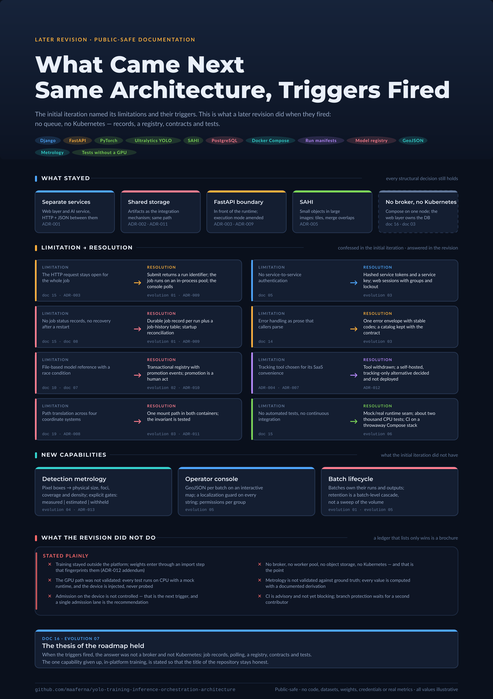

# What Came Next: A Later Revision of the Same Architecture

> Public-safe documentation. This section describes a later revision of the reference
> architecture at the level of design decisions. It names no organization, application field,
> site, hardware model or measured result, and it dates nothing by calendar. Every number is
> illustrative.

## Purpose

The architecture documents (`01` to `21`) describe the initial iteration of the platform and
argue, in `15` and `16`, that a job queue, a worker pool and Kubernetes should wait for
operational evidence. This section records what happened when some of that evidence arrived:
which triggers fired, what was built in response, what was deliberately not built, and what the
revision left unresolved. It exists so that the limitations confessed in the initial iteration
can be read together with their outcome.

## The same problem, a later revision

The revision addresses the same class of problem: a small group of operators submits
high-resolution detection work to a GPU-backed service and needs the results traceable. The
service topology is unchanged and every structural ADR of the initial iteration still holds:

| Kept from the initial iteration | Record |
|---|---|
| Web layer and AI service as separate processes, HTTP + JSON between them | ADR-001 |
| Shared artifact storage as the integration mechanism | ADR-002 |
| FastAPI as the boundary in front of the GPU runtime | ADR-003 |
| SAHI for small objects in large images | ADR-005 |
| Notebooks as research, never as the production path | ADR-006 |
| Relational database owned by the web layer only; the AI service holds no database | `03` |
| Docker Compose on one node; no Kubernetes; no message broker | `16` |

What changed is narrower than a rewrite and is listed in the table below. Each row is a
limitation the initial iteration wrote down, the trigger it named, and the document that
describes the response.

| Confessed in the initial iteration | Trigger named there | Response | Read |
|---|---|---|---|
| The HTTP request stays open for the whole job (`15`, ADR-003) | Timeouts, operators needing progress | Submit returns a run identifier; the job runs on an in-process pool; the console polls | [`01`](./01-submit-poll-execution.md), ADR-009 |
| No job status records, no recovery after a restart (`15`, `08` risk 5) | Failures become hard to explain | Durable job record per run plus a job-history table; startup reconciliation | [`01`](./01-submit-poll-execution.md), ADR-009 |
| File-based model reference with a race condition (`10`, `07`) | Lineage questions hard to answer from storage | Transactional model registry with promotion events; human promotion | [`02`](./02-model-registry-and-promotion.md), ADR-010 |
| Path translation across four coordinate systems (`19`, ADR-008) | Path bugs in result synchronization | One mount path in both containers; the invariant is tested | [`03`](./03-service-contracts.md), ADR-011 |
| No service-to-service authentication (`05`) | Any caller could submit GPU work | A service key between the two services; hashed bearer tokens for automation; sessions with groups and lockout for operators | [`03`](./03-service-contracts.md) |
| Error handling as prose (`14`) | Callers parse messages | One error envelope with stable codes; a catalog kept with the contract | [`03`](./03-service-contracts.md) |
| Tracking tool chosen for its SaaS convenience (ADR-004, ADR-007) | Data leaving the premises by default | Tool withdrawn; a self-hosted alternative decided and **not** deployed | ADR-012 |
| Detections stop at pixel boxes | Operators asked for physical quantities | A detection-metrology job type in the AI service | [`04`](./04-detection-metrology.md), ADR-013 |
| Results shown as image previews only | Operators asked "where" | GeoJSON per batch rendered on an interactive map in the console | [`05`](./05-operator-console.md) |
| The AI service ran on the host, outside Docker (`06`) | Driver stack drift between host and containers | The AI service is containerized; GPU passthrough is configured explicitly and off by default | [`06`](./06-testing-and-ci-strategy.md) |
| No automated tests, no CI (`15`) | Every change was a manual check | A mock/real runtime seam and a CPU test suite on the order of two thousand tests; CI on a throwaway Compose stack | [`06`](./06-testing-and-ci-strategy.md) |

The full trigger-by-trigger reconciliation against `16` is in
[`07-roadmap-realized.md`](./07-roadmap-realized.md).

## What left the platform

Two things the initial iteration did inside the platform were moved out, and the reader should
not infer otherwise from the documents that follow.

**Training runs outside the platform in the revision.** The training endpoint, the multi-seed
strategy and the continuous-improvement loop of `09` and `10` were exercised in the initial
iteration. The revision keeps a training job type and its state machine behind the mock/real
seam, but training itself is performed in notebooks and enters the platform through an import
step that fingerprints the weights and registers a model version. The reason is recorded in
ADR-012's addendum: the training stack needed a newer deep-learning runtime than the pinned
inference set, and coupling them would have blocked inference releases on training upgrades.
This was a decision, not an omission. The initial iteration remains the backbone of this
repository because it is the one that orchestrated training on the GPU.

**The GPU path was not validated in the revision.** The AI service container exposes the GPU
only when explicitly enabled, the health endpoint reports the GPU as not configured by default,
and the whole test suite runs on CPU with a mock runtime. Every claim in this section about
throughput, contention or device behavior is therefore a design claim. The runtime facts about
GPUs, DataParallel and DDP remain those of the initial iteration (`13`).

## How to read this section

- Read `00` to `03` for the orchestration story: execution, registry, contracts. These close
  the gaps the initial iteration named.
- Read `04` and `05` for capabilities the initial iteration did not have: metrology and the
  operator console with maps.
- Read `06` for the engineering discipline that made the revision reviewable.
- Read `07` last: it is the ledger of the roadmap.

Each document keeps the structure of the architecture documents (purpose, context, design,
constraints, risks, improvements) and, where a decision was reversed, points at the ADR that
supersedes or amends the original.

## Constraints

- Everything here is described at the level of categories. Module, table and endpoint names of
  the revision are not published.
- No timeline. "Initial iteration" and "revision" are the only ordering the repository uses.
- Nothing measured is reported: no test counts beyond an order of magnitude, no throughput, no
  accuracy.

## Summary

The revision is evidence that the thesis of `16` held. When the triggers fired, the answer was
not a broker and not Kubernetes: it was job records, polling, a registry, contracts and tests.
The one capability the revision gave up, in-platform training, is stated here so that the title
of this repository stays honest.
