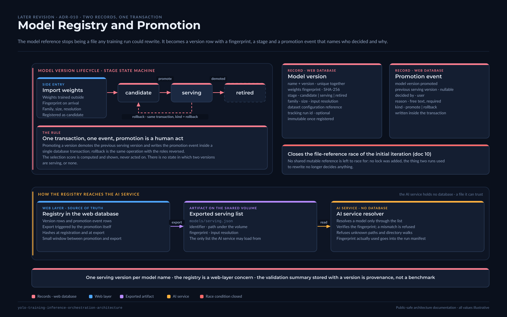

# Model Registry and Promotion

> Public-safe documentation. Design-level description of a later revision. Field names are
> descriptive, not the real schema; the selection weights are illustrative.

[](../../assets/diagrams/09-model-registry-promotion.png)

## Purpose

The initial iteration kept "the current best model" as a reference file in shared storage,
rewritten by whichever training run scored higher (`10-continuous-improvement-training.md`,
`07-shared-storage-and-artifacts.md`). The race condition that design admits was the most
discussed finding of this repository, and `adr/README.md` noted that a formal registry had no
decision record. This document describes the registry the revision adopted, and ADR-010 records
the decision.

## Context

The trigger from `16` was "lineage questions become hard to answer from storage alone". They
did: which weights produced a given batch of results, who decided to switch models, and what the
previous model was, could only be reconstructed from file timestamps. Two further facts shaped
the design:

- training had moved out of the platform (`00-what-came-next.md`), so weights arrive from
  outside and must be identified on arrival, not trusted by path;
- the AI service holds no database, so whatever the registry decides has to reach it as a file.

## Design

### Two records, one transaction

```text
  Model version record                  Promotion event record
  ────────────────────                  ──────────────────────
  name + version   (unique together)    model version promoted
  weights fingerprint (SHA-256)         previous serving version (nullable)
  stage: candidate | serving | retired  decided by (user)
  family, size, input resolution        reason (free text, required)
  dataset configuration reference       kind: promote | rollback
  validation summary (illustrative)
  external tracking run id (nullable)
```

**A model version is immutable once registered.** Name and version are unique together; the
fingerprint is computed from the weights file at registration and checked again whenever the
file is resolved. A file whose fingerprint no longer matches is refused, not silently served.

**Promotion is one transaction and one event.** Promoting a version to serving demotes the
previous serving version and writes a promotion event with the previous version, the user and a
reason, inside a single database transaction. Rollback is the same operation with the roles
reversed and the kind set to rollback. There is no state in which two versions are serving or
none is.

**Promotion is a human act.** The selection score (an illustrative weighted combination of a
recall-oriented metric and mAP50) is computed and shown; it never promotes on its own. The
initial iteration's automatic "update on improvement" is exactly what produced the race, and
the revision decided that a person reading the score is cheaper than a lock.

### How the registry reaches the AI service

The web layer exports a small JSON document listing the model versions the AI service may
load: identifier, path under the shared volume, fingerprint, input resolution. The AI service
resolves a model **only** through that document. It refuses to walk directories or to accept an
arbitrary path in a request, which closes the class of bugs where a job silently picks up
whichever weights file was newest.

```text
  Registry (web DB) ──export──►  models/serving.json  ──read──►  AI service resolver
                                   (on the shared volume)          verifies fingerprint
                                                                   refuses unknown paths
```

### Import path for externally trained weights

Since training happens outside the platform, a management command registers a weights file:
it computes the fingerprint, records family, size and resolution from the file, links the
dataset configuration the operator names, and creates the version as a candidate. Only a
promotion moves it to serving.

## Constraints

- The registry is a web-layer concern. The AI service knows only the exported document.
- One serving version per model name. Serving two variants side by side would need a second
  name, not a second stage.
- The validation summary stored with a version is whatever the validation job produced; it is
  provenance, not a benchmark.

## Risks

**Export lag.** Between a promotion transaction and the next export, the AI service may still
resolve the previous version. The export is triggered by the promotion itself, so the window is
small, but it exists and is worth a check in the job manifest (which records the fingerprint
actually used).

**Fingerprint cost.** Hashing large weights files on every resolution is wasteful. The revision
hashes at registration and at export, and verifies size and modification time at resolution,
falling back to a full hash only when those differ.

**The score is not the truth.** A candidate can beat the serving version on the summary and be
worse in the field. Promotion being human is the mitigation; the residual risk is a person
promoting on the score alone.

## Recommended Improvements

1. Record the fingerprint of the model actually used in every run manifest (the revision
   does; keep it mandatory).
2. Attach the dataset configuration version to the model version as a foreign key rather than a
   reference string, once dataset versions are themselves registered.
3. A retention rule for retired versions and their weights, so the volume does not become the
   archive.

## Summary

The registry turns the model reference from a file that any training run could rewrite into a
version record with a fingerprint, a stage, and a promotion event that names who decided and
why. It reaches the AI service as an exported list that the resolver trusts exclusively. This
closes the race condition of `10` without a lock, because there is no longer anything to race
for. ADR-010 records the decision.
