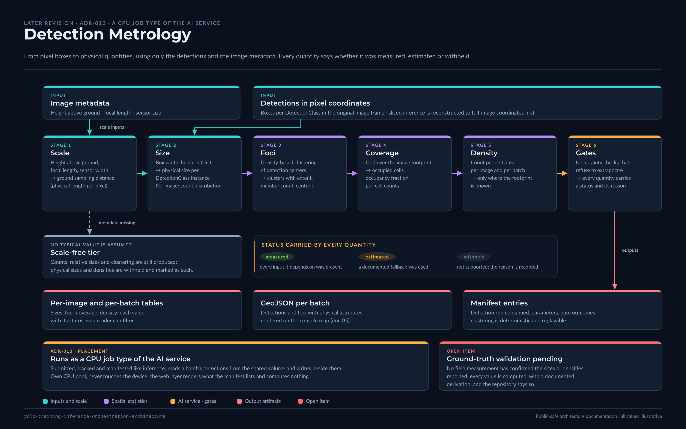

# Detection Metrology: From Pixel Boxes to Physical Quantities

> Public-safe documentation. This document describes a method at the level of stages and
> decisions. It names no application field, species, site, sensor or aircraft, and it states no
> real threshold, scale or result. `DetectionClass` stands for whatever is being detected.
> Ground-truth validation of the method is explicitly pending.

[](../../assets/diagrams/10-detection-metrology.png)

## Purpose

The initial iteration ended at detections: bounding boxes in pixel coordinates, drawn on a
preview. Operators asked questions the boxes could not answer: how large are these objects in
physical units, how are they distributed across the area, and how dense are they per unit of
area. The revision added a metrology stage that answers those questions from the same
detections and the image metadata, and ADR-013 records where that stage lives.

## Context

High-resolution aerial imagery carries, in its metadata, enough to recover scale: the camera's
focal length and sensor size, and the height above ground at capture. From scale, a pixel box
becomes a physical size; from many boxes and their positions, a spatial distribution. None of
this needs a GPU, all of it needs care about units and about what is unknown.

## Design

### Stages

```text
  detections (px)  +  image metadata
          │
          ▼
  1. Scale        height above ground, focal length, sensor width
                  → ground sampling distance (GSD, physical length per pixel)
                  missing metadata → scale-free tier (see below)
          │
          ▼
  2. Size         box width/height × GSD → physical size per DetectionClass instance
                  aggregated per image: count, size distribution
          │
          ▼
  3. Foci         density-based clustering of detection centers
                  → clusters ("foci") with extent, member count, centroid
          │
          ▼
  4. Coverage     grid over the image footprint
                  → occupied cells, occupancy fraction, per-cell counts
          │
          ▼
  5. Density      count per unit area, per image and per batch
                  → only where the footprint is known
          │
          ▼
  6. Gates        uncertainty checks that refuse to extrapolate
                  → each quantity carries a status: measured | estimated | withheld
          │
          ▼
  outputs         per-image and per-batch tables, GeoJSON (see 05), manifest entries
```

### Decisions inside the method

**Scale comes from metadata, never from assumption.** If height above ground or the camera
parameters are missing, the run does not guess a typical value. It drops to a **scale-free
tier**: counts, relative sizes and clustering are still produced, physical sizes and densities
are withheld and marked as such.

**Gates are explicit and conservative.** A quantity is reported as *measured* only when every
input it depends on was present in the metadata; as *estimated* when a documented fallback was
used (for example, a per-batch height when a single image lacks it); and *withheld* otherwise.
The gates and their reasons are part of the output, so a downstream reader can filter on them.
Their numeric values are configuration, not published constants.

**Clustering is deterministic.** The density-based algorithm and its parameters are recorded in
the manifest; re-running the same detections yields the same foci.

**Extrapolation to areas not imaged is a separate, gated step.** Estimating a total for a
whole area from sampled images is where the largest errors live. The revision supports it only
when a sampling design is declared and the coverage gate passes, and it labels the result as an
estimate with its assumptions.

### Where it runs

Metrology is a **job type of the AI service** (ADR-013): it is submitted, tracked and
manifested like inference (`01`, `03`), reads the detection outputs of a batch from the shared
volume, and writes its own outputs beside them. It runs on CPU, on its own pool, and never
touches the device. The alternative, computing it in the web layer at render time, was
rejected because the results must be reproducible artifacts, not view logic.

## Constraints

- Requires that detections carry pixel coordinates in the original image frame. Sliced
  inference (`11`) must reconstruct to full-image coordinates before metrology.
- Requires image metadata to be preserved through ingestion. Formats that strip it lose the
  measured tier.
- Physical sizes are planar: they assume the object lies on the ground plane. Height of the
  object itself is not recovered.

## Risks

**The method is not yet validated against ground truth.** No field measurement campaign has
confirmed the physical sizes or densities the stage reports. Until one has, every measured value
is a computed value with a documented derivation, and the repository says so.

**Metadata can be wrong, not just missing.** A height above ground recorded relative to
take-off rather than to terrain shifts every size. The gates detect absence, not error;
plausibility checks are the mitigation and are listed as an improvement.

**Extrapolation invites over-reading.** A per-area estimate on a table looks like a
measurement. The status column exists to prevent that; the risk is a reader who ignores it.

## Recommended Improvements

1. Plausibility bounds on scale inputs (height, GSD) with a *suspect* status distinct from
   *withheld*.
2. A ground-truth protocol: physical references of known size in a subset of images, so the
   size stage can be checked per batch.
3. Terrain-aware height, when elevation data is available for the footprint.
4. Confidence intervals on density from the sampling design, rather than point estimates.

## Summary

Metrology converts detections into physical sizes, clusters, coverage and density, using only
the detections and the image metadata, and it refuses to report what it cannot support. It runs
as a CPU job type of the AI service with the same job record, manifest and error contracts as
inference. Its validation against ground truth is the open item, stated as such.
